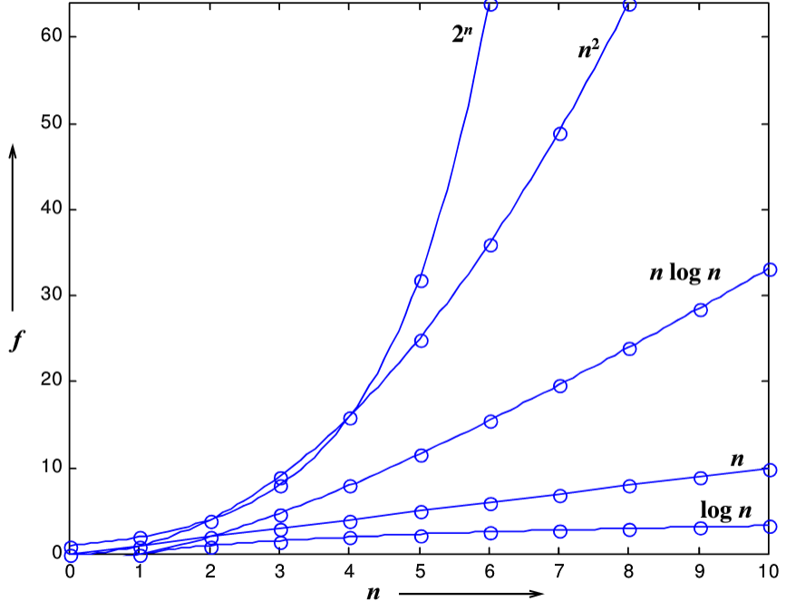

- [基本概念](#基本概念)
  - [什么是数据结构](#什么是数据结构)
    - [关于数据组织](#关于数据组织)
    - [关于空间使用](#关于空间使用)
    - [关于算法效率](#关于算法效率)
    - [抽象的好处](#抽象的好处)
  - [什么是算法](#什么是算法)
    - [基本概念](#基本概念-1)
    - [算法复杂度的渐进表示法](#算法复杂度的渐进表示法)
    - [复杂度分析](#复杂度分析)
    - [复杂度分类](#复杂度分类)
  - [最大子列和问题](#最大子列和问题)
    - [算法3：分而治之](#算法3分而治之)
    - [算法4：在线处理](#算法4在线处理)

<a id="markdown-基本概念" name="基本概念"></a>
# 基本概念

<a id="markdown-什么是数据结构" name="什么是数据结构"></a>
## 什么是数据结构
<a id="markdown-关于数据组织" name="关于数据组织"></a>
### 关于数据组织
例1：如何在书架上摆放图书
解决问题方法的效率，根数据的组织方式有关
<a id="markdown-关于空间使用" name="关于空间使用"></a>
### 关于空间使用
例2：写程序实现一个函数PrintN，使得传入一个正整数为N的参数后，能顺序打印从 $1$ 到$N$的全部正整数
+ 循环实现
>```C
>void PrintN(int N)
>{
>    if(N)
>    {
>        PrintN(N-1);
>        printf("%d\n",N);
>    }
>    return ;
>}
>```
+ 递归实现
>```C
>void PrintN2(int N)
>{
>    int i;
>    for (i = 1; i <= N; i++)
>    {
>        printf("%d\n",i);
>    }
>    
>    return ;
>}
>```

令$N = 100,1000,10000,100000,\dots$

当$N = 100000$的时候，递归调用需要的空间很大，在未输出就已经停止

==解决问题方法的效率根空间的利用效率有关==

<a id="markdown-关于算法效率" name="关于算法效率"></a>
### 关于算法效率
例3：写程序计算给定多项式在定点$x$处的值$f(x)=a_0+a_1x+\dots+a_{n-1}x^{n-1}+a_nx^n$
```C
double f1( int n, double a[], double x)
{
    int i;
    double p=a[0];
    for ( i = 1; i <= n; i++)
    {
        p += (a[i]*pow(x,i));//慢
    }
    return p;
}

```
```C
double f2( int n, double a[], double x)
{
    int i;
    double p=a[0];
    for ( i = n; i >= 1; i--)
    {
        p = a[i-1] + p*x;//区别
    }
    return p;
}
```
>__clock()__：捕捉从程序开始运行到clock()被调用时所耗费的时间。这个时间单位是clock tick，即时钟打点"。
>
>**常数CLK_TCK(或CLOCKS_PER_SEC)**：机器时钟每秒所走的时钟打点数。
```C
#include<stdio.h>
#include<time.h>
clock_t start，stop；
/*clock_t是clock()函数返回的变量类型*/
double duration；
/*记录被测函数运行时间，以秒为单位*/
int main（）
{/*不在测试范围内的准备工作写在clock()调用之前*/
    start=clock()；/*开始计时*/
    MyFunction()；/*把被测函数加在这里*/
    stop=clock()；/*停止计时*/
    duration=((double)(stop-start))/CLK_TCK；
    /*计算运行时间*/
    /*其他不在测试范围的处理写在后面，例如输出duration的值*/
    return 0；
}
```
例3：写程序计算给定多项式$f(x)=\sum\limits_{i=0}^{9}a_i x^i$
在给定点$x=1.1$处的值，$f(1.1)$
```C
#include<stdio.h>
#include<time.h>
#include<math.h>

clock_t start, stop;

double duration;

#define MAXN 10 /*多项式最大项数，即多项式阶数+1*/
/*
让被测函数重复运行充分多次，使得测出的总的时钟打点间隔充分长，最后计算被测函数平均每次运行的时间即可！
*/
#define MAXK 1e7 /*被测函数最大重复调用次数*/
double f1( int n, double a[], double x)
{
    int i;
    double p=a[0];
    for ( i = 1; i <= n; i++)
    {
        p += (a[i]*pow(x,i));
    }
    return p;
}
double f2( int n, double a[], double x)
{
    int i;
    double p=a[0];
    for ( i = n; i >= 1; i--)
    {
        p = a[i-1] + p*x;
    }
    return p;
}
int main()
{
    int i;
    double a[MAXN]; /*存储多项式的系数*/
    
    for ( i = 0; i < MAXN; i++)
    {
        a[i] = (double)i;
    }
    start = clock();
    for (int i = 0; i < MAXK; i++)  /*重复调用函数以获得充分多的时钟打点数*/
    {
        f1(MAXN-1, a, 1.1);
    }
    stop = clock();
    duration = ( (double) (stop = start) )/CLK_TCK; /*计算函数单次运行的时间*/
    printf("ticks1 = %f\n", (double)(stop - start ) );
    printf("duration1 = %6.2e\n", duration);

    start = clock();
    for (int i = 0; i < MAXK; i++)
    {
        f2(MAXN-1, a, 1.1);
    }
    stop = clock();
    duration = ( (double) (stop = start) )/CLK_TCK;
    printf("ticks2 = %f\n", (double)(stop - start ) );
    printf("duration2 = %6.2e\n", duration);

    return 0;
}
```
==解决问题方法的效率，跟算法的巧妙程度有关==
<a id="markdown-抽象的好处" name="抽象的好处"></a>
### 抽象的好处 
+ 什么是数据结构
  + **数据对象**在计算机中的组织方式
    + 逻辑结构
    + 物理存储结构
  + 数据对象必定与一系列加在其上的**操作**相关联
  + 完成这些操作所用的方法就是**算法** 
+ 抽象数据类型$(Abstract Data Type)$
  + 数据类型
    + 数据对象集
    + 数据集合相关联的操作集 
  + 抽象：抽象数据类型的方法不依赖于具体实现
    + 与存放数据的机器无关
    + 与数据存储的物理结构无关
    + 与实现操作的算法和编程语言无关
  + 只描述数据对象集和相关操作集“是什么”，并不涉及“如何做到”的问题 
例4：“矩阵”的抽象数据类型定义


<a id="markdown-什么是算法" name="什么是算法"></a>
## 什么是算法
<a id="markdown-基本概念-1" name="基本概念-1"></a>
### 基本概念
+ 算法$(Algorithm)$
  + 一个有限指令集
  + 接受一些输入（有些情况下不需要输入）
  + 产生输出
  + 一定在有限步骤之后终止（不能有无限循环的概念）
  + 每一条指令必须
    + 有充分明确的目标，不可以有歧义
    + 计算机能处理的范围之内
    + 描述应不依赖于任何一种计算机语言以及具体的实现手段
   
例1：选择排序算法的伪码描述
```C
void SelectionSort(int List[],int N)
{/*将N个整数List[0]...List[N-1]进行非递减排序*/
    for(i=0;i<N;i++)
    {
        MinPosition=ScanForMin(List,i,N-1);
        /*从List[i]到List[N-1]中找最小元，并将其位置赋给MinPosition*/
        Swap(List[i],List[MinPosition]);
        /*将未排序部分的最小元换到有序部分的最后位置*/
    }
}
```
<a id="markdown-算法复杂度的渐进表示法" name="算法复杂度的渐进表示法"></a>
### 算法复杂度的渐进表示法
+ $T(n)=\mathrm{O}(f(n))$表示存在常数$C>0,n_o>0$使得$n>n_o$时，$T(n)\leq Cf(n)$ 上界
+ $T(n)=\mathrm{\Omega}(f(n))$表示存在常数$C>0,n_o>0$使得$n>n_o$时，$T(n)\geq Cf(n)$    下界
+ $T(n)=\mathrm{\Theta}(f(n))$表示存在常数$C>0,n_o>0$使得$n>n_o$时，$T(n)= Cf(n)$ 等价


<a id="markdown-复杂度分析" name="复杂度分析"></a>
### 复杂度分析
+ 若两段算法分别有复杂度$T_1(n)=\mathrm{O}(f_1(n))和T_2(n）=
\mathrm{O}(f_2(n))$，则
  + $T_1(n)+T_2(n)=max(\mathrm{O}(f_1(n)),\mathrm{O}(f_2(n)))$
  + $T_1(n)×T_2(n)=\mathrm{O}(f_1(n)xf_2(n))$嵌套
  + 若$T(n)$是关于$n$的$k$阶多项式，那么$T(n)=\mathrm{O}(n^k)$真正起作用的只有最大项
  + 一个**for**循环的时间复杂度等于循环次数乘以循环体代码的复杂度
  + **if-else**结构的复杂度取决于if的条件判断复杂度和两个分枝部分的复杂度，总体复杂度取三者中最大
<a id="markdown-复杂度分类" name="复杂度分类"></a>
### 复杂度分类
+ 时间复杂度$T(n)$
+ 空间复杂度$S(n)$
<a id="markdown-最大子列和问题" name="最大子列和问题"></a>
## 最大子列和问题
例：给定$N$个整数的序列${A_1,A_2,\dots,A_N}$，求函数的$f(i,j)=\mathrm{max}\{0,\sum\limits_{k=i}^jA_k\}$最大值
### 算法3：分而治之

$$
\begin{aligned}
    T(N)&=2*T(N/2)+cN,\qquad &T(1)=\mathrm{O}(1)\\
        &=2*[2*2*T(N/2)+cN/2]+cN\\
        &=2^k\mathrm{O}(1)+ckN  \qquad &其中N/2^k=1\\
        &=\mathrm{O}(N\mathrm{log}N)
\end{aligned}
$$
```C
int Max3( int A, int B, int C )
{ /* 返回3个整数中的最大值 */
    return A > B ? A > C ? A : C : B > C ? B : C;
}
 
int DivideAndConquer( int List[], int left, int right )
{ /* 分治法求List[left]到List[right]的最大子列和 */
    int MaxLeftSum, MaxRightSum; /* 存放左右子问题的解 */
    int MaxLeftBorderSum, MaxRightBorderSum; /*存放跨分界线的结果*/
 
    int LeftBorderSum, RightBorderSum;
    int center, i;
 
    if( left == right )  { /* 递归的终止条件，子列只有1个数字 */
        if( List[left] > 0 )  return List[left];
        else return 0;
    }
 
    /* 下面是"分"的过程 */
    center = ( left + right ) / 2; /* 找到中分点 */
    /* 递归求得两边子列的最大和 */
    MaxLeftSum = DivideAndConquer( List, left, center );
    MaxRightSum = DivideAndConquer( List, center+1, right );
 
    /* 下面求跨分界线的最大子列和 */
    MaxLeftBorderSum = 0; LeftBorderSum = 0;
    for( i=center; i>=left; i-- ) { /* 从中线向左扫描 */
        LeftBorderSum += List[i];
        if( LeftBorderSum > MaxLeftBorderSum )
            MaxLeftBorderSum = LeftBorderSum;
    } /* 左边扫描结束 */
 
    MaxRightBorderSum = 0; RightBorderSum = 0;
    for( i=center+1; i<=right; i++ ) { /* 从中线向右扫描 */
        RightBorderSum += List[i];
        if( RightBorderSum > MaxRightBorderSum )
            MaxRightBorderSum = RightBorderSum;
    } /* 右边扫描结束 */
 
    /* 下面返回"治"的结果 */
    return Max3( MaxLeftSum, MaxRightSum, MaxLeftBorderSum + MaxRightBorderSum );
}
 
int MaxSubseqSum3( int List[], int N )
{ /* 保持与前2种算法相同的函数接口 */
    return DivideAndConquer( List, 0, N-1 );
}
```
###  算法4：在线处理
 ```C
int MaxSubseqSum4(int A[],int N)
{
    int Thissum,MaxSum;
    int i;
    ThisSum=MaxSum=0;
    for(i=0;i<N;i++)
    {
        ThisSum+=A[i];/*向右累加*/
        if(ThisSum>MaxSum)
            MaxSum=ThisSum;/*发现更大和则更新当前结果*/
        else if(Thissum<0)/*如果当前子列和为负*/
            Thissum=0;/*则不可能使后面的部分和增大，抛弃之*/
    }
    return MaxSum;
}
```
  $T(N)=O(N)$
