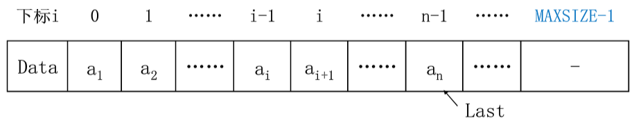
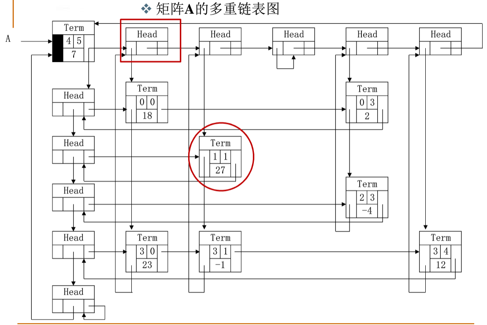
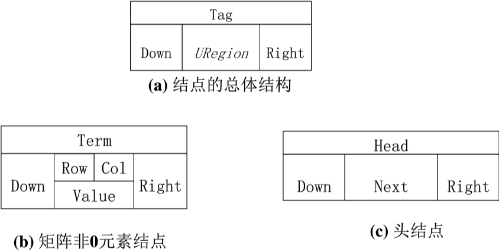
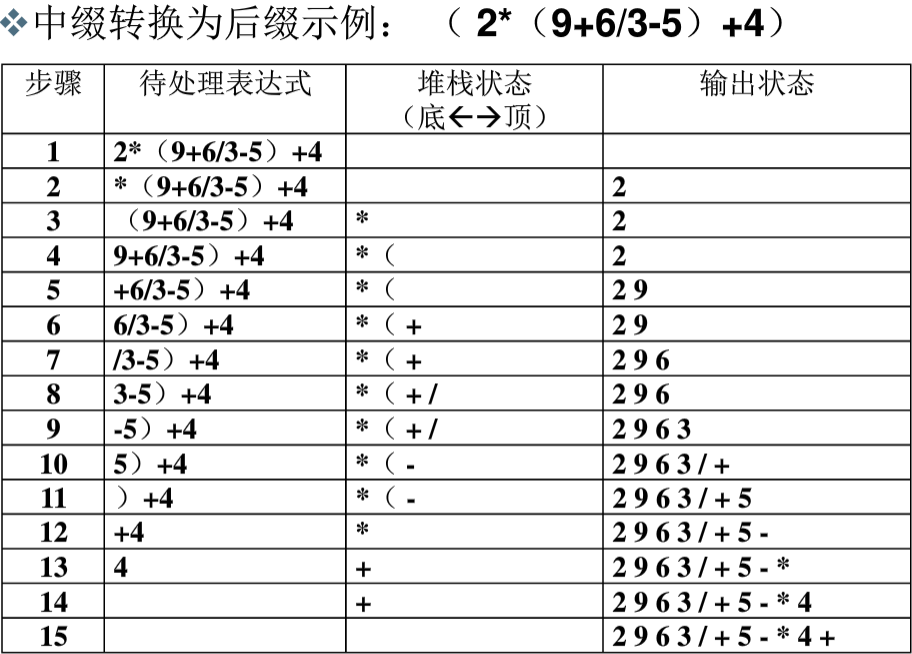

# 线性表

## 什么是线性表
Linear List : 由同类型**数据元素**构成**有序序列**的线性结构
+ 表中元素个数称为线性表的长度
+ 线性表没有元素时，称为空表
+ 表起始位置称表头，表结束位置称表尾
### 线性表的抽象数据类型描述
**类型名称**：线性表(**List**)  
**数据对象集**：线性表是($n\geq 0$)个元素构成的有序序列($a_1,a_2,\dots,a_n$)  
**操作集**：线性表**L$\in$List**，整数**i**表示位置，元素**X$\in$ElementType**  
**线性表基本操作**主要有：
1. **List MakeEmpty()**：初始化一个空线性表L；
2. **Element Type FindKth(intK，ListL)**：根据位序K，返回相应元素；
3. **int Find(ElementType X，ListL)**：在线性表**L**中查找**X**的第一次出现位置；
4. **void Insert(ElementType X，inti，ListL)**：在位序**i**前插入一个新元素X；
5. **void Delete(int i，ListL)**：删除指定位序的元素；
6. **int Length(ListL)**：返回线性表**L**的长度**n**。
## 线性表的顺序存储实现

```C
typedef struct LNode* List;
struct LNode{
    ElementType Data[MAXSIZE];
    int Last;
};
struct LNodeL;
List PtrL;
```
访问下标为i的元素：L.Data[i]或PtrL->Data[i]

线性表的长度：L.Last+1或PtrL->Last+1
## 主要操作实现
1. 初始化（建立空的线性表）
```C
List MakeEmpty()
{
    List PtrL;
    PtrL=(List)malloc(sizeof(struct LNode));
    PtrL->Last=-1;
    return PtrL;
}
```
2. 查找
```C
#define ERROR -1
 
Position Find( List L, ElementType X )
{
    Position i = 0;
 
    while( i <= L->Last && L->Data[i]!= X )
        i++;
    if ( i > L->Last )  
        return ERROR; /* 如果没找到，返回错误信息 */
    else  
        return i;  /* 找到后返回的是存储位置 */
}
```
3. 插入
```C
/*注意:在插入位置参数P上与课程视频有所不同，课程视频中i是序列位序（从1开始），这里P是存储下标位置（从0开始），两者差1*/
bool Insert( List L, ElementType X, Position P ) 
{ /* 在L的指定位置P前插入一个新元素X */
    Position i;
 
    if ( L->Last == MAXSIZE-1) {
        /* 表空间已满，不能插入 */
        printf("表满"); 
        return false; 
    }  
    if ( P<0 || P>L->Last+1 ) { /* 检查插入位置的合法性 */
        printf("位置不合法");
        return false; 
    } 
    for( i=L->Last; i>=P; i-- )
        L->Data[i+1] = L->Data[i]; /* 将位置P及以后的元素顺序向后移动 */
    L->Data[P] = X;  /* 新元素插入 */
    L->Last++;       /* Last仍指向最后元素 */
    return true; 
} 
```
4. 删除
```C
/*注意:在删除位置参数P上与课程视频有所不同，课程视频中i是序列位序（从1开始），这里P是存储下标位置（从0开始），两者差1*/
bool Delete( List L, Position P )
{ /* 从L中删除指定位置P的元素 */
    Position i;
 
    if( P<0 || P>L->Last ) { /* 检查空表及删除位置的合法性 */
        printf("位置%d不存在元素", P ); 
        return false; 
    }
    for( i=P+1; i<=L->Last; i++ )
        L->Data[i-1] = L->Data[i]; /* 将位置P+1及以后的元素顺序向前移动 */
    L->Last--; /* Last仍指向最后元素 */
    return true;   
}
```
## 线性表的链式存储实现
1. 初始化
```C
typedef struct LNode *PtrToLNode;
struct LNode {
    ElementType Data;
    PtrToLNode Next;
};
typedef PtrToLNode Position;
typedef PtrToLNode List;
```
2. 查找
```C
#define ERROR NULL
 
Position Find( List L, ElementType X )
{
    Position p = L; /* p指向L的第1个结点 */
 
    while ( p && p->Data!=X )
        p = p->Next;
 
    /* 下列语句可以用 return p; 替换 */
    if ( p )
        return p;
    else
        return ERROR;
}
```
3. 带头结点的插入
```C 
/*注意:在插入位置参数P上与课程视频有所不同，课程视频中i是序列位序（从1开始），这里P是链表结点指针，在P之前插入新结点 */
bool Insert( List L, ElementType X, Position P )
{ /* 这里默认L有头结点 */
    Position tmp, pre;
 
    /* 查找P的前一个结点 */        
    for ( pre=L; pre&&pre->Next!=P; pre=pre->Next ) ;            
    if ( pre==NULL ) { /* P所指的结点不在L中 */
        printf("插入位置参数错误\n");
        return false;
    }
    else { /* 找到了P的前一个结点pre */
        /* 在P前插入新结点 */
        tmp = (Position)malloc(sizeof(struct LNode)); /* 申请、填装结点 */
        tmp->Data = X; 
        tmp->Next = P;
        pre->Next = tmp;
        return true;
    }
}
```
4. 带头结点的删除
```C 
/*注意:在删除位置参数P上与课程视频有所不同，课程视频中i是序列位序（从1开始），这里P是拟删除结点指针 */
bool Delete( List L, Position P )
{ /* 这里默认L有头结点 */
    Position tmp, pre;
 
    /* 查找P的前一个结点 */        
    for ( pre=L; pre&&pre->Next!=P; pre=pre->Next ) ;            
    if ( pre==NULL || P==NULL) { /* P所指的结点不在L中 */
        printf("删除位置参数错误\n");
        return false;
    }
    else { /* 找到了P的前一个结点pre */
        /* 将P位置的结点删除 */
        pre->Next = P->Next;
        free(P);
        return true;
    }
}
```
## 广义表
+ 广义表是**线性表的推广**；
+ 对于线性表而言，n个元素都是基本的**单元素**；
+ 广义表中，这些元素不仅可以是单元素也可以是**另一个广义表**。
```C
typedef struct GNode* GList;
struct GNode
{
    int Tag;/*标志域：0表示结点是单元素，1表示结点是广义表*/
    union{/*子表指针域Sublist与单元素数据域Data复用，即共用存储空间*/
        ElementType Data;
        GList SubList;
    }URegion;
    GList Next;/*指向后继结点*/
};
```
## 多重链表
**多重链表**：链表中的节点可能同时隶属于多个链
+ 多重链表中结点的**指针域会有多个**，如前面例子包含了Next和SubList两个指针域
+ 但包含两个指针域的链表并不一定是多重链表，比如在**双向链表不是多重链表**。
+ 多重链表有广泛的用途：基本上如树、图这样相对复杂的数据结构都可以采用多重链表方式实现存储。

采用一种典型的多重链表——十字链表来存储稀疏矩阵
+ 只存储矩阵非0元素项
+ 结点的数据域：行坐标Row、列坐标Col、数值Value每个结点通过两个指针域，把同行、同列串起来；
  + 行指针（或称为向右指针）Right
  + 列指针（或称为向下指针）Down
  + **第一个term是整个矩阵的入口，表示该矩阵为4行5列七个非零元素的矩阵**

+ 用一个标识域Tag来区分头结点和非0元素结点：
+ 头节点的标识值为“Head”，矩阵非0元素结点的标识值为“Term”。


# 堆栈
## 堆栈的抽象数据类型描述
栈（Stack）：具有一定操作约束的线性表
+ 只在一端（栈顶，Top）做插入、删除
+ 插入数据：入栈（Push）
+ 删除数据：出栈（Pop）
+ 后入先出：Last In First Out（LIFO）

**类型名称**：堆栈（Stack）  
**数据对象集**：一个有**0**个或多个元素的有穷线性表。  
**操作集**：长度为**MaxSize**的堆栈$S\in Stack$，堆栈元素$item\in ElementType$
1. **Stack CreateStack(int MaxSize)**：生成空堆栈，其最大长度为**MaxSize**；
2. **int IsFull(Stack S，int MaxSize)**：判断堆栈**S**是否已满；
3. ***void Push(Stack S，ElementType item)**：将元素**item**压入堆栈；
4. **int IsEmpty(StackS**)：判断堆栈S是否为空；
5. **ElementType Pop(Stack S）**：删除并返回栈顶元素；
## 栈的顺序存储实现
数组实现的话，需要数组的尾做栈顶
1. 声明
```C
typedef int Position;
struct SNode {
    ElementType *Data; /* 存储元素的数组 */
    Position Top;      /* 栈顶指针 */
    int MaxSize;       /* 堆栈最大容量 */
};
```
2. 创建栈
```C
typedef struct SNode *Stack;
 
Stack CreateStack( int MaxSize )
{
    Stack S = (Stack)malloc(sizeof(struct SNode));
    S->Data = (ElementType *)malloc(MaxSize * sizeof(ElementType));
    S->Top = -1;
    S->MaxSize = MaxSize;
    return S;
}
```
3. 判断满栈
```C
bool IsFull( Stack S )
{
    return (S->Top == S->MaxSize-1);
}
```
4. 入栈
```C 
bool Push( Stack S, ElementType X )
{
    if ( IsFull(S) ) {
        printf("堆栈满");
        return false;
    }
    else {
        S->Data[++(S->Top)] = X;
        return true;
    }
}
```
5. 判断非空
```C 
bool IsEmpty( Stack S )
{
    return (S->Top == -1);
}
```
6. 出栈
```C 
ElementType Pop( Stack S )
{
    if ( IsEmpty(S) ) {
        printf("堆栈空");
        return ERROR; /* ERROR是ElementType的特殊值，标志错误 */
    }
    else 
        return ( S->Data[(S->Top)--] );
}
```
## 栈的链表存储实现
单向链表来实现的话，栈顶在链式的头
```C
typedef struct SNode *PtrToSNode;
struct SNode {
    ElementType Data;
    PtrToSNode Next;
};
```
```C
typedef PtrToSNode Stack;
 
Stack CreateStack( ) 
{ /* 构建一个堆栈的头结点，返回该结点指针，头结点作为栈顶 */
    Stack S;
 
    S = (Stack)malloc(sizeof(struct SNode));
    S->Next = NULL;
    return S;
}
```
```C
bool IsEmpty ( Stack S )
{ /* 判断堆栈S是否为空，若是返回true；否则返回false */
    return ( S->Next == NULL );
}
```
```C 
bool Push( Stack S, ElementType X )
{ /* 将元素X压入堆栈S */
    PtrToSNode TmpCell;
 
    TmpCell = (PtrToSNode)malloc(sizeof(struct SNode));
    TmpCell->Data = X;
    TmpCell->Next = S->Next;
    S->Next = TmpCell;
    return true;
}
```
```C 
ElementType Pop( Stack S )  
{ /* 删除并返回堆栈S的栈顶元素 */
    PtrToSNode FirstCell;
    ElementType TopElem;
 
    if( IsEmpty(S) ) {
        printf("堆栈空"); 
        return ERROR;
    }
    else {
        FirstCell = S->Next; 
        TopElem = FirstCell->Data;
        S->Next = FirstCell->Next;
        free(FirstCell);
        return TopElem;
    }
}
```
## 堆栈应用：中缀表达式求值
### 中缀表达式求值
1. 运算数相对顺序不变堆栈
2. 运算符号顺序发生改变
    + 需要存储“等待中”的运算符号号
    + 要将当前运算符号与“等待中”的最后一个运算符号比较
### 中缀表达式如何转换为后缀表达式  
==$a\times (b+c)/d=?\qquad 输出：a\ b\ c\ +\ *\ d\ /$==

从头到尾读取中缀表达式的每个对象，对不同对象按不同的情况处理。

1. 运算数：直接输出；
2. 左括号：压入堆栈；
3. 右括号：将栈顶的运算符弹出并输出，直到遇到左括号（出栈，不输出）；
4. 运算符：
   + 若优先级大于栈顶运算符时，则把它压栈；
   + 若优先级小于等于栈顶运算符时，将栈顶运算符弹出并输出；再比较新的栈顶运算符，直到该运算符大于栈顶运算符优先级为止，然后将该运算符压栈；
5. 若各对象处理完毕，则把堆栈中存留的运算符一并输出。
### 堆栈的其他应用：
+ 函数调用及递归实现
+ 深度优先搜索
+ 回溯算法
+ $\dots$
+ 
# 队列
## 什么是队列
**队列（Queue）**：具有一定操作约束的线性表口插入和删除  
+ 操作：只能在一端插入，而在另一端删除。
+ 数据插入：入队列（AddQ）
+ 数据删除：出队列（DeleteQ）
+ 先来先服务
+ 先进先出：FIFO
## 队列的抽象数据类型描述
**类型名称**：队列（**Queue**）  
**数据对象集**：一个有**0**个或多个元素的有穷线性表。  
**操作集**：长度为**MaxSize**的队列**Q= Queue**，队列元素$item\in  ElementType$  
1. **Queue CreatQueue（int MaxSize**）：生成长度为**MaxSiz**e的空队列；a
2. **int IsFullQ（Queue Q，int MaxSize）**：判断队列**Q**是否已满；
3. **void AddQ（Queue Q，ElementType item）**：将数据元素**item**插入队列**Q**中；
4. **wint IsEmptyQ（Queue Q）**：判断队列**Q**是否为空；
5. **ElementType DeleteQ（Queue Q）**：将队头数据元素从队列中删除并返回。
## 队列的顺序存储实现
&emsp;队列的顺序存储结构通常由一个一维数组和一个记录队列头元素位置的变量**front**以及一个记录队列尾元素位置的变量**rear**组成。
+ 空集的时候front rear=-1;
+ 增加元素的时候，rear+1；
+ 删除元素的时候，front+1，front指向的元素为空;

顺序队列：
+ 与以上类似
+ 但是当front = rear的时候，队列可能为空，可能为满
  + 使用额外标记：**Size记录队列的元素个数**或者**tag记录最后一次的操作是插入还是删除**
  + 仅使用n-1个数组空间
```C
#define MaxSize<储存数据元素的最大个数>
struct QNode
{
    ElementType Data[MaxSize];
    int rear;
    int front;
};
typedef struct QNode* Queue;
```
```C
typedef int Position;
struct QNode {
    ElementType *Data;     /* 存储元素的数组 */
    Position Front, Rear;  /* 队列的头、尾指针 */
    int MaxSize;           /* 队列最大容量 */
};
```
```C
typedef struct QNode *Queue;
 
Queue CreateQueue( int MaxSize )
{
    Queue Q = (Queue)malloc(sizeof(struct QNode));
    Q->Data = (ElementType *)malloc(MaxSize * sizeof(ElementType));
    Q->Front = Q->Rear = 0;
    Q->MaxSize = MaxSize;
    return Q;
}
```
```C 
bool IsFull( Queue Q )
{
    return ((Q->Rear+1)%Q->MaxSize == Q->Front);
}
```
```C 
bool AddQ( Queue Q, ElementType X )
{
    if ( IsFull(Q) ) {
        printf("队列满");
        return false;
    }
    else {
        Q->Rear = (Q->Rear+1)%Q->MaxSize;
        Q->Data[Q->Rear] = X;
        return true;
    }
}
```
```C 
bool IsEmpty( Queue Q )
{
    return (Q->Front == Q->Rear);
}
 
ElementType DeleteQ( Queue Q )
{
    if ( IsEmpty(Q) ) { 
        printf("队列空");
        return ERROR;
    }
    else  {
        Q->Front =(Q->Front+1)%Q->MaxSize;
        return  Q->Data[Q->Front];
    }
}
```
## 队列的链式存储实现
&emsp;队列的链式存储结构也可以用一个单链表实现。插入和删除操作分别在链表的两头进行；队列指针**front**和**rear**应该分别指向链表的哪一头？  
**链式的头做front 尾做rear**
```C
typedef struct Node *PtrToNode;
struct Node { /* 队列中的结点 */
    ElementType Data;
    PtrToNode Next;
};
```
```C
typedef PtrToNode Position;
 
struct QNode {
    Position Front, Rear;  /* 队列的头、尾指针 */
    int MaxSize;           /* 队列最大容量 */
};
```
```C
typedef struct QNode *Queue;
 
bool IsEmpty( Queue Q )
{
    return ( Q->Front == NULL);
}
```
```C 
ElementType DeleteQ( Queue Q )
{
    Position FrontCell; 
    ElementType FrontElem;
     
    if  ( IsEmpty(Q) ) {
        printf("队列空");
        return ERROR;
    }
    else {
        FrontCell = Q->Front;
        if ( Q->Front == Q->Rear ) /* 若队列只有一个元素 */
            Q->Front = Q->Rear = NULL; /* 删除后队列置为空 */
        else                     
            Q->Front = Q->Front->Next;
        FrontElem = FrontCell->Data;
 
        free( FrontCell );  /* 释放被删除结点空间  */
        return  FrontElem;
    }
}
```

# 多项式加法运算