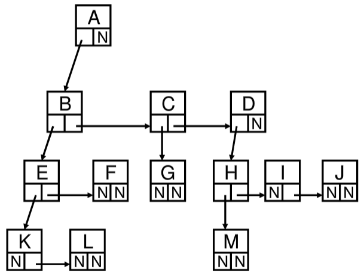
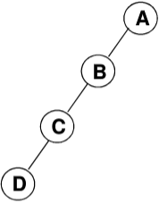
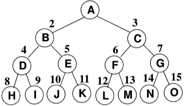
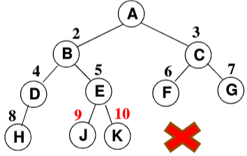
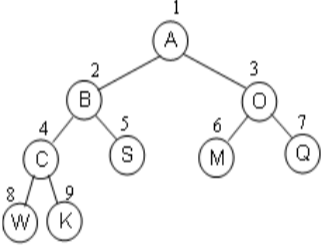

# 引子
## 查找
查找：根据某个给定关键字K，从集合R中找出关键字与K相同的记录
### 静态查找
静态查找：集合中记录是固定的
+ 没有插入和删除操作，只有查找
1. 顺序查找
```C
int SequentialSearch(StaticTable*Tbl，ElementType K)
{/*在表Tb1[1]~Tb1[n]中查找关键字为K的数据元素*/
    int i;
    Tb1->Element[0]=K;
    /*建立哨兵，这样在写for循环判断条件的时候可以少写一个判断是否到达边界的条件*/
    for(i=Tbl->Length;Tbl->Element[i]！=K;i--);
    return i;/*查找成功返回所在单元下标；不成功返回0*/
}


typedef struct LNode* List;
struct Lnode
{
    ElementType Element[MAXSIZE];
    int Length;
};
```
2. 二分查找
+ 假设假设n个数据元素的关键字满足有序（比如：小到大）  
  $k_1<k_2 < \dots  < k_n$  
  并且是连续存放（数组），那么可以进行二分查找。
```C
int BinarySearch(Static Table*Tbl,ElementType K)
{/*在表Tbl中查找关键字为K的数据元素*/
    int left,right,mid,NoFound=-1;
    left=1;/*初始左边界*/
    right=Tbl->Length;/*初始右边界*/
    while(left <=right)
    {
        mid =(left+right)/2;/*计算中间元素坐标*/
        if(K < Tbl->Element[mid])
            right=mid-1;/*调整右边界*/
        else if(K>Tbl->Element[mid])
            left=mid+1;/*调整左边界*/
        else 
            return mid;/*查找成功,返回数据元素的下标*/
    }
    return NotFound;/*查找不成功，返回-1*/
}
```
+ ==时间复杂度为$\mathrm{O(log} N)$==
+ 二分查找的启示：**二分查找判断树**（二叉树）
  + 判定树上每个结点需要的查找次数刚好为该结点所在的**层数**；
  + 查找成功时查找次数不会超过判定树的**深度**
  + n个结点的判定树的深度为$[\mathrm{log}_2n]+1$].
### 动态查找
动态查找：集合中记录是动态变化的
+ 除查找，还可能发生插入和删除
# 什么是树
## 树的定义
**树（Tree）**：n（n20）个结点构成的有限集合。
当n=0时，称为空树；  
对于任一棵非空树（n>0），它具备以下性质：
+ 树中有一个称为“**根（Root）**”的特殊结点，用 **r** 表示；  
+ 其余结点可分为**m（m>0）**个互不相交的有限集$T_1,T_2,\dots ,T_n$，其中每个集合本身又是一棵树，称为原来树的“**子树（SubTree）**”
+ 子树是**不相交**的；
+ 除了根结点外，**每个结点有且仅有一个父结点**；
+ ==一棵N个结点的树有N-1条边==。
## 树的一些基本术语
1. **结点的度（Degree）**：结点的**子树个数**
2. **树的度**：树的所有结点中最大的度数
3. **叶结点（Leaf）**：**度为0**的结点
4. **父结点（Parent）**：有子树的结点是其子树的根结点的父结点
5. **子结点（Child）**：若A结点是B结点的父结点，则称B结点是A结点的子结点；子结点也称孩子结点。
6. **兄弟结点（Sibling**）：具有同一父结点的各结点彼此是兄弟结点。
7. **路径和路径长度**：从结点n到n的**路径**为一个结点序列$n_1,n_2,\dots ,n_k$，$n_i$是$n_{i+1}$的父结点。路径所包含边的个数为**路径的长度**。
8. **祖先结点（Ancestor）**：沿**树根到某一结点路径**上的所有结点都是这个结点的祖先结点。
9. **子孙结点（Descendant）**：某一结点的**子树中的所有结点**是这个结点的子孙。
10. **结点的层次（Level）**：规定**根结点在1层**，其它任一结点的层数是其父结点的层数加1。
11. **树的深度（Depth）**：树中所有结点中的**最大层次**是这棵树的深度。
## 树的表示
+ 儿子——兄弟表示法
| Element | |
|:---:|---|
|FirstChild|NextSibing|

+ 二叉树表示法
| Element | |
|:---:|---|
|Left|Right|
# 二叉树
**二叉树T**：一个有穷的结点集合。
+ 这个集合可以为**空**
+ 若不为空，则它是由**根结点**和称为其**左子树TL**和**右子树TR**的两个不相交的二叉树组成。
+ 二叉树具有五种基本形态
  + 空
  + 单结点
  + 只有左子树
  + 只有右结点
  + 左右结点均有 
+ 二叉树的子树有左右顺序之分
## 特殊二叉树
+ 斜二叉树（Skewed Binary Tree）  

+ 完美二叉树（Perfect Binary Tree）/满二叉树（Ful1Binary Tree）   

+ 完全二叉树（Complete Binary Tree）  
&emsp;有n个结点的二叉树，对树中结点按从上至下、从左到右顺序进行编号，编号为$i(1\leq i\leq n)$结点与满二叉树中编号为 $i$ 结点在二叉树中位置相同  

## 二叉树几个性质
+ 一个二叉树第**i**层的最大结点数为：$2^{i-1},i\geq 1$。
+ 深度为**k**的二叉树有最大结点总数为：$2^{k}-1,k\geq 1$。
+ 对任何非空二叉树T，若$n_0$表示叶结点的个数、$n_2$是度为2的非叶结点个数，那么两者满足关系$n_0=n_2+1$。
## 二叉树的抽象数据类型定义
+ **类型名称：二叉树**
+ **数据对象集**：一个有穷的结点集合。  
&emsp;若不为空，则由**根结点和其左、右二叉子树**组成。
+ **操作集**：$BT\in BinTree，ltem=\in ElementType$，重要操作有：  
  1.  **Boolean IsEmpty（BinTree BT**）：判别BT是否为空；
  2.  **void Traversal（BinTree BT）**：遍历，按某顺序访问每个结点；
  3.  **BinTree CreatBinTree（）**：创建一个二叉树。

+ 常用的遍历方法有：
  + **void PreOrderTraversal（BinTree BT）**：先序----根、左子树、右子树；
  + **void InOrder Traversal（Bin Tree BT）**：中序---左子树、根、右子树；
  + **void PostOrder Traversal（BinTree BT）**：后序---左子树、右子树、根
  + **void LevelOrder Traversal（BinTree BT）**：层次遍历，从上到下、从左到右
## 二叉树的存储结构
1. 顺序存储结构  
   + **完全二叉树**：按从上至下、从左到右顺序存储 **n** 个结点的完全二叉树的**结点父子**关系：
     + 非根结点（序号**i>1**）的父结点的序号是$\lfloor i/2 \rfloor$；
     + 结点（序号为i）的左孩子结点的序号是 **2i**，（若2i<=n，否则没有左孩子）；
     + 结点（序号为i）的右孩子结点的序号是 **2i+1**，（若2i+1<=n，否则没有右孩子）；  


   + **一般二叉树**也可以采用这种结构，但会造成空间浪费.……
     + 按照对应的完全二叉树的形式编号来存储 
2. 链表存储结构
```C
typedef struct TreeNode *BinTree; 
typedef BinTree Position; 
struct TreeNode{
    ElementType Data; 
    BinTree Left; 
    Bin Tree Right;
};
```
## 二叉树的遍历
1. 先序遍历
+ 访问根结点
+ 先序遍历其左子树
+ 先序遍历其右子树
```C
void PreOrderTraversal( BinTree BT )
{
    if( BT) 
    {
        printf ("%d", BT->Data); 
        PreOrderTraversal( BT->Left ); 
        PreOrderTraversal( BT->Right );
    }
}
```
2. 中序遍历
+ 中序遍历其左子树
+ 访问根结点
+ 中序遍历其右子树
```C
void PreOrderTraversal( BinTree BT )
{
    if( BT) 
    {
        PreOrderTraversal( BT->Left ); 
        printf ("%d", BT->Data); 
        PreOrderTraversal( BT->Right );
    }
}
```
3. 后序遍历
+ 后序遍历其左子树
+ 后序遍历其右子树
+ 访问根结点
```C
void PreOrderTraversal( BinTree BT )
{
    if( BT) 
    {
        PreOrderTraversal( BT->Left ); 
        PreOrderTraversal( BT->Right );
        printf ("%d", BT->Data); 
    }
}
```
## 二叉树的非递归遍历
中序遍历非递归遍历算法
非递归算法实现的基本思路：使用堆栈

+ 遇到一个结点，就把它压栈，并去遍历它的左子树；
+ 当左子树遍历结束后，从栈顶弹出这个结点并访问它；
+ 然后按其右指针再去中序遍历该结点的右子树。
```C
void InOrderTraversal(BinTree BT)
{
    BinTree T=BT;
    stack s = Creatstack(MaxSize);/*创建并初始化堆栈s*/
    while(T|| !IsEmpty(S))
    {
        while(T)
        {
            /*一直向左并将沿途结点压入堆栈*/
            Push(S,T);
            T=T->Left;
        }
        if(!IsEmpty(S))
        {
            T=Pop(S);/*结点弹出堆栈*/
            printf("%5d",T->Data);/*（访问）打印结点*/
            T=T->Right;/*转向右子树*/
        }
    }
}
```
## 二叉树的层序遍历
二叉树遍历的核心问题：二维结构的线性化
+ 从结点访问其左、右儿子结点
+ 访问左儿子后，右儿子结点怎么办？
  + 需要一个存储结构保存暂时不访问的结点
  + 存储结构：堆栈、队列

层序基本过程：先根结点入队，然后：
1. 从队列中取出一个元素；
2. 访问该元素所指结点；
3. 若该元素所指结点的左、右孩子结点非空，则将其左、右孩子的指针顺序入队。
```C
void LevelOrderTraversal(BinTree BT)
{
    t Queue Q;
    BinTree T;
    if(！BT)
        return;/*若是空树则直接返回*/
    Q = CreatQueue(MaxSize);/*创建并初始化队列Q*/
    AddQ(Q，BT);
    while(！IsEmptyQ(Q))
    {
        T = Deleteg(Q);
        printf("d\n"，T->Data);/*访问取出队列的结点*/
        if(T->Left)
            AddQ(Q，T->Left);
        if(T->Right)
            AddQ(，T->Right);
    }
}
```
## 应用
1. 求树的高度（利用后序遍历）
2. 二元表达式树及其遍历
3. 由两种遍历序列确定二叉树
   + 必须要有中序序列才行


```C
void InorderTraversal( BinTree BT )
{
    if( BT ) {
        InorderTraversal( BT->Left );
        /* 此处假设对BT结点的访问就是打印数据 */
        printf("%d ", BT->Data); /* 假设数据为整型 */
        InorderTraversal( BT->Right );
    }
}
 
void PreorderTraversal( BinTree BT )
{
    if( BT ) {
        printf("%d ", BT->Data );
        PreorderTraversal( BT->Left );
        PreorderTraversal( BT->Right );
    }
}
 
void PostorderTraversal( BinTree BT )
{
    if( BT ) {
        PostorderTraversal( BT->Left );
        PostorderTraversal( BT->Right );
        printf("%d ", BT->Data);
    }
}
 
void LevelorderTraversal ( BinTree BT )
{ 
    Queue Q; 
    BinTree T;
 
    if ( !BT ) return; /* 若是空树则直接返回 */
     
    Q = CreatQueue(); /* 创建空队列Q */
    AddQ( Q, BT );
    while ( !IsEmpty(Q) ) {
        T = DeleteQ( Q );
        printf("%d ", T->Data); /* 访问取出队列的结点 */
        if ( T->Left )   AddQ( Q, T->Left );
        if ( T->Right )  AddQ( Q, T->Right );
    }
}
```